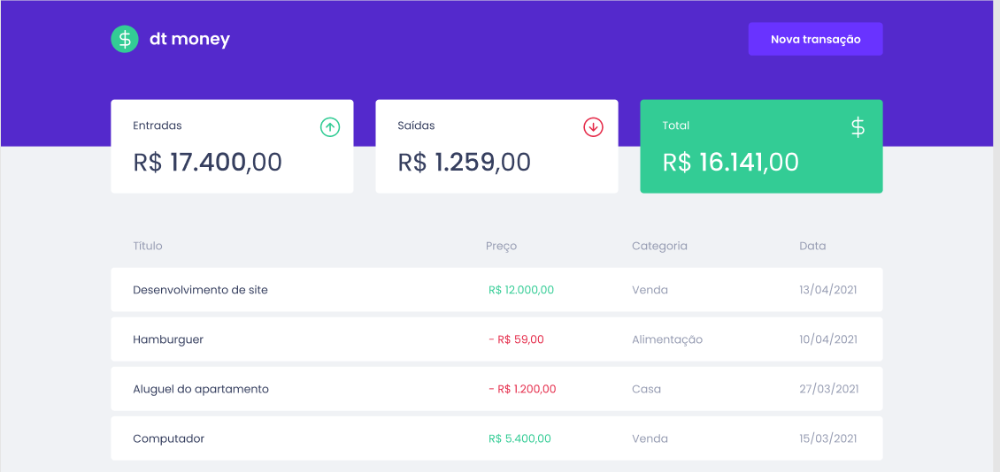
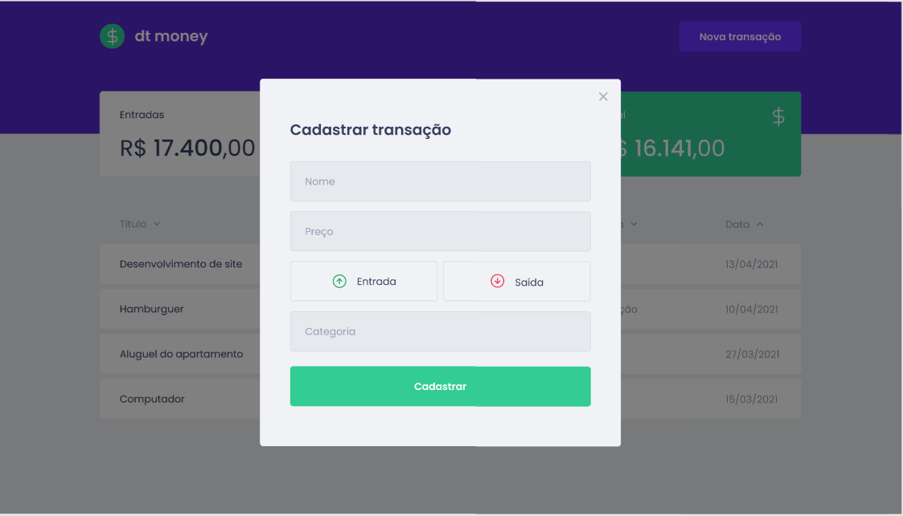

<h1 align="center"> Ignite ReactJS </h1>
<h2 align="center"> Aplicação web com ReactJS </h2>

## 🚀 Sobre o Projeto
Aplicação front-end web completa utilizando conceitos e ferramentas importantes do ecossistema React 
como Styled Components, MirageJS, Context API, hooks, Axios e muito mais

## 📷 Screen Shots
<div align="center">
    
   </br>
       
   </br>
</div>

## ⚙️ Rodando o Projeto

```bash
# Abra um terminal e copie este repositório com o comando
git clone https://github.com/nsthiago/dtmoney
# ou use a opção de download.

# Entre na pasta da aplicação 
# Instale as dependências
yarn install

# Rode a aplicação
yarn dev

# Acesse http://localhost:8080 no seu navagador
```
